## Introduction

In this lab, you will explore Database Management for HeatWave MySQL DB System. Database Management provides a single-pane-of-glass view of your fleet of cloud and on-premises databases in OCI, and enables you to detect issues. Here are some of the tasks you can perform using Database Management, which are categorized under database monitoring and management areas.

Estimated time: 20 minutes

### Objectives

- Use Oracle Cloud Infrastructure Database Management to manage a fleet of MySQL Databases and drill down to a single database for further investigation.
- Explore Database Management Summary.
- Explore all Metrics of HeatWave MySQL DB system.
- Explore Configuration variables of HeatWave MySQL DB system.
- Explore Alarm definitions of HeatWave MySQL DB system.
- Diagnose database performance issues quickly with Performance Hub.

## Task 1: Getting Started with Database Management

1. Login to the Oracle Cloud Console, click the **Navigation Menu** in the upper left, navigate to **Observability & Management**, and select **Database Management**.

     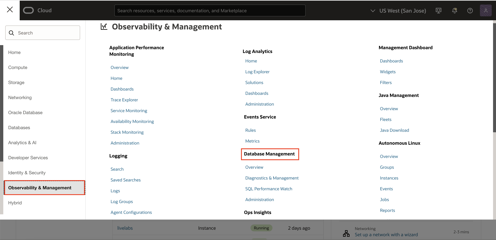

     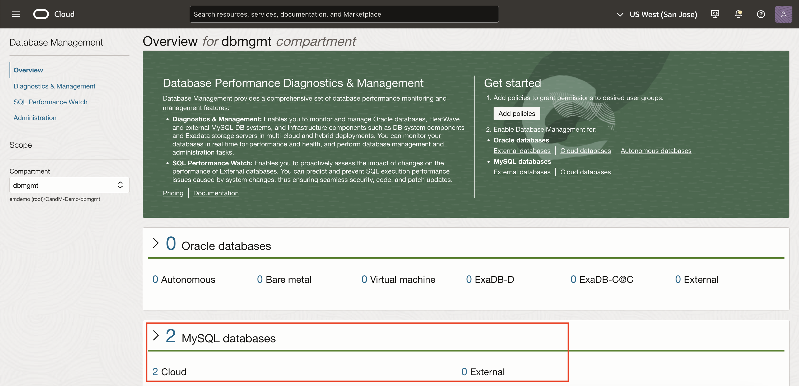

2. The **MySQL databases** tile (on the **Overview** page) displays the total number of HeatWave MySQL Databases and external MySQL DB systems in the compartment and region for which Database Management is enabled.

## Task 2: Monitoring a Fleet of MySQL Databases

1. On the left pane, click **Diagnostics & Management** to navigate to the **HeatWave & MySQL fleet summary** page. The dbmgmt compartment is selected by default in the Compartment field. Set the **Compartment** to **dbmgmt** following the navigation -

     

     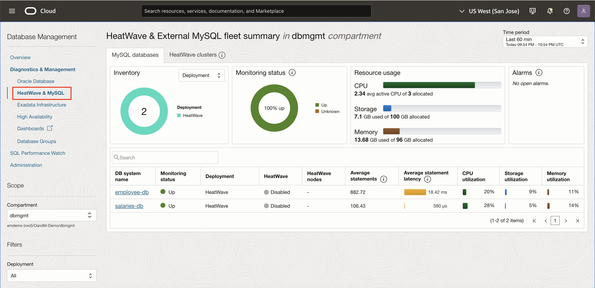

2. The following tiles are available on the **Fleet Summary** page:

    - **Inventory**: Displays the number of MySQL Databases in the compartment.
    - **Monitoring Status**: Displays the availability status of the managed MySQL Databases in the compartment.
    - **Resource Usage**: Displays a summary of the overall CPU utilization, Storage and Memory allocation for the selected time period on the top-left corner of the page.
    - **Alarms**: Displays the total number of open database alarms in the compartment and the number of alarms by severity.

    Below the tiles, the list of HeatWave and External MySQL DB systems for which Database Management is enabled is displayed along with the following information:
    - **DB system name**: Name of the DB system.
    - **Monitoring status**: Monitoring status of the DB system.
    - **HeatWave**: HeatWave enablement status. Indicates whether a HeatWave cluster is attached to the HeatWave DB system. This information is only displayed for HeatWave DB systems.
    - **HeatWave nodes**: Number of HeatWave nodes in the HeatWave cluster. This information is only displayed for HeatWave DB systems.
    - **Average statements**: Displays the Average number of SQL statements executed per minute.
    - **Average statement latency**: Displays the Average latency (in milliseconds) for the executed SQL statements.
    - **CPU utilization**: Displays the Percentage of CPU utilized by the DB system.
    - **Storage utilization**: Displays the Percentage of storage utilized by the DB system.
    - **Memory utilization**: Displays the Percentage of memory utilized by the DB system.

## Task 3: Monitor a Single HeatWave MySQL DB system - Summary

1. In the **Fleet Summary** page, select **employee-db**.

     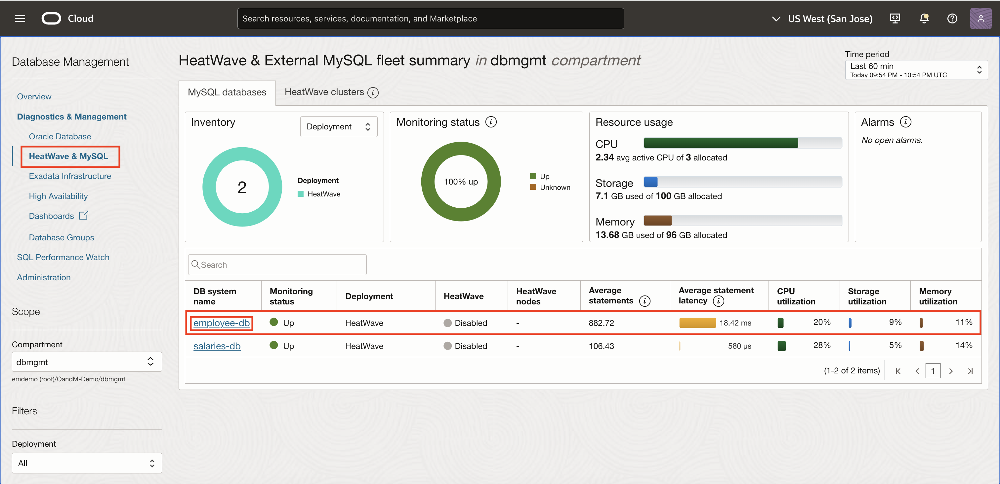

2. Click the **employee-db** database. In the **Resources** page you will get to the **Summary** section.

     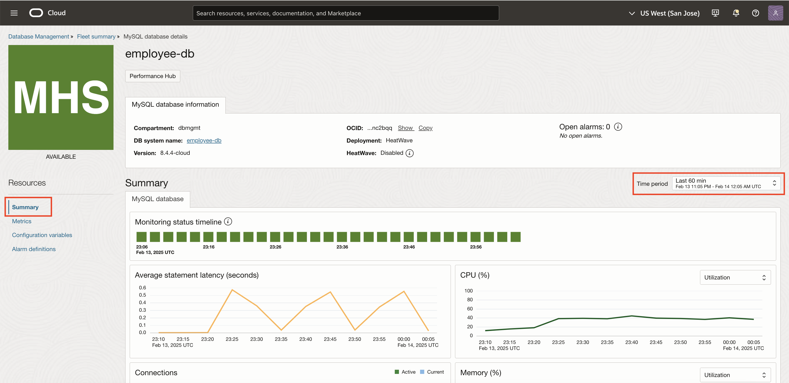

     

3. We can monitor database performance attributes in the **Summary** section, for the time period selected in the **Time Period** menu on the top of this page. Last 60 min is the default time period, and the visual representations or charts provide a quick insight into the health of the database during the selected time period.

     **Monitoring status timeline**: Displays the availability of the database during the selected period of time. The color of the blocks denotes the status and the number of blocks denotes the time slots within the selected time period over which availability is checked. For example, if the default time period, Last 60 min, is selected, then each block represents a period of two minutes.

     **Metric charts such as Average statement latency (seconds) and CPU (%)**: Monitor the visual representation of DB system metrics or metric charts in the Summary section to obtain a quick insight into the performance and core resource utilization of your DB system. These charts enable you to analyze data better by monitoring different parameters such as active connections, disk operations and throughput. You can hover the mouse on the charts to view additional details such as the metric name (Series), date and time, and value; filter the data in the charts by clicking the options displayed in the legend. For descriptions of the metric charts, see [HeatWave and External MySQL DB System Metric Charts](https://docs.oracle.com/en-us/iaas/database-management/doc/mysql-heatwave-metric-charts.html#GUID-758BB559-01FF-4EEC-9CF9-266B94A2604F).

     The Summary section is displayed by default on the MySQL database details page, however, you can click one of the other options on the left pane under Resources.

## Task 4: Monitor a Single HeatWave MySQL DB system - Metrics

1. In the **Resources** page, click on the **Metrics** section.  In the summary page, only a couple of metrics are shown. To view all the metrics you can see them in the Metrics page.

     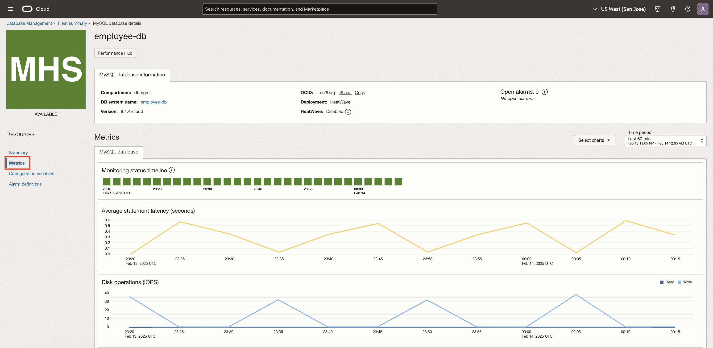

2. You can select or unselect whatever metrics you wish to see in the Metrics page

     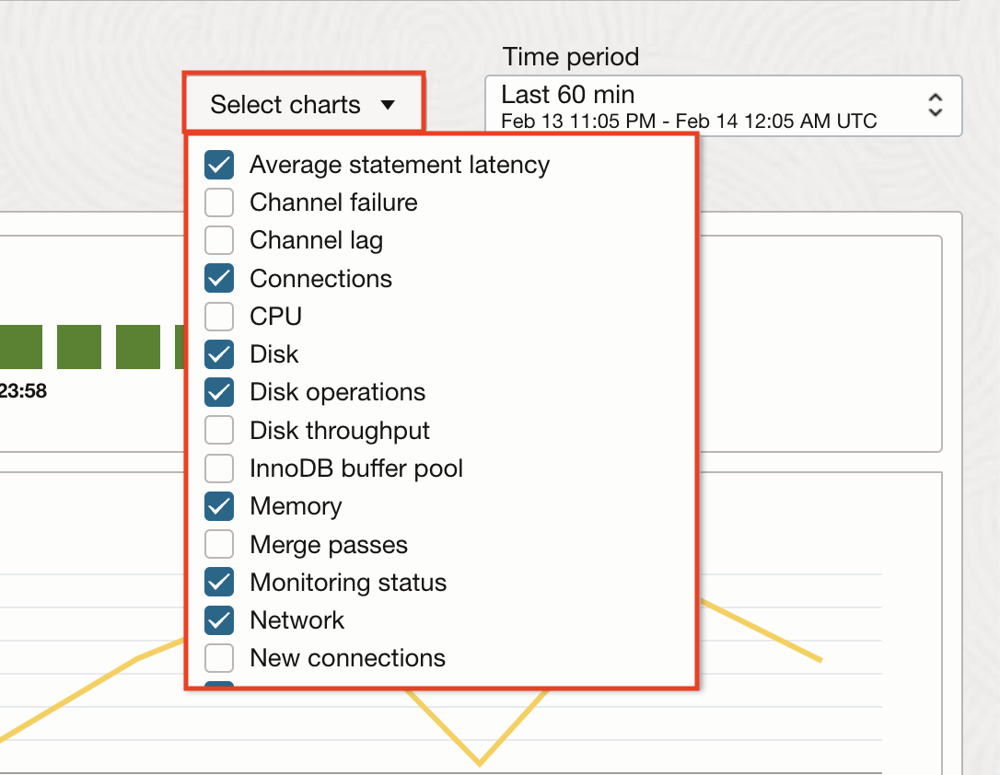

## Task 5: Monitor a Single HeatWave MySQL DB system - Configuration variables

1. In the **Resources** page, click on the **Configuration variables** section. You can monitor the configuration variables that are currently used by running instances.

2. Configuration variables are the user, system, initialization, or service-specific variables that define the operation of the DB system.

     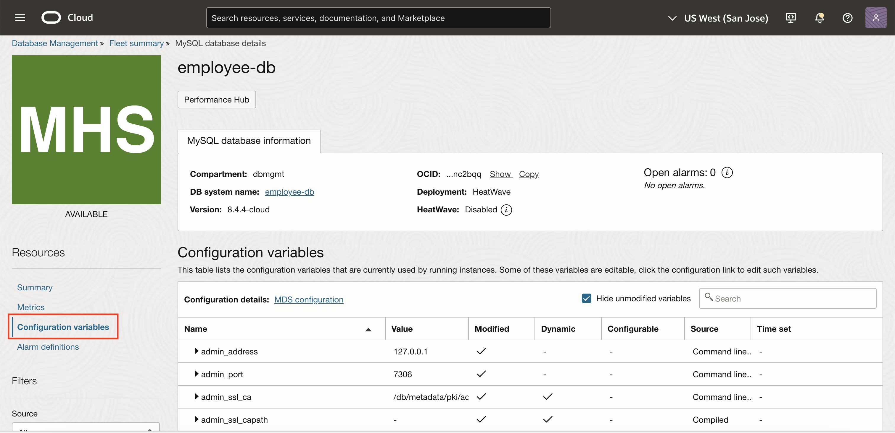

3. In the Configuration variables section, you can use filters on the left pane to filter the configuration variables.

     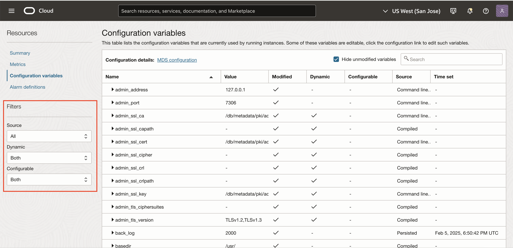

4. Click the **MDS configuration** link to go to the Configuration details page in the HeatWave service and view the MySQL configuration used by the HeatWave DB system.

     *Note that the MDS configuration link is only displayed for a HeatWave DB system and you must have the required MySQL HeatWave service permissions to go to the Configuration details page.*

5. Deselect the Hide unmodified variables check box to view the variables that were not modified. This check box is selected by default.

     

6. View the following configuration variable information:

    - **Name**: Name of the configuration variable.
     Click the Arrow icon adjacent to the name of the configuration variable to view the default and current value.

    - **Value**: Value of the configuration variable.
    - **Modified**: Check mark to indicate if the configuration variable was modified.
    - **Dynamic**: Check mark to indicate if the configuration variable is a dynamic variable, which means changing the variable does not require restarting the DB system.
    - **Configurable**: Check mark to indicate if the configuration variable is configurable.
    - **Source**: Source from which the configuration variable was most recently set. For information on the various types of sources, see Performance Schema variables_info Table.
    - **Time set**: Date and time the configuration variable was most recently set.

    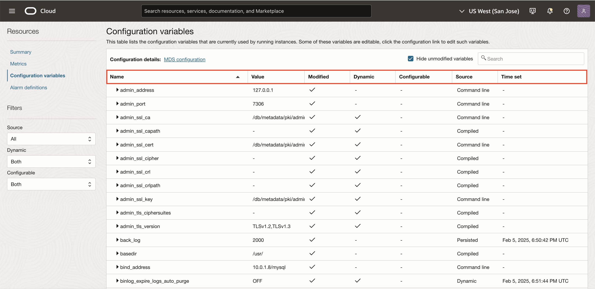

## Task 6: Set Up Alarm Definitions for HeatWave MySQL

1. In the **Resources** page, click on the **Alarm definitions** section. You can set up alarm definitions to simplify the process of creating and managing alarms for HeatWave MySQL DB systems in Database Management.

     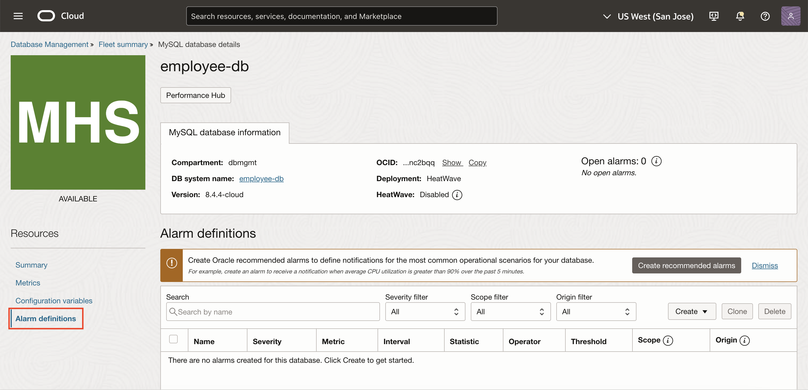

2. In the Alarm definitions section, you can:

- Create Oracle recommended alarms that are preconfigured for common operational scenarios for your HeatWave DB system.

     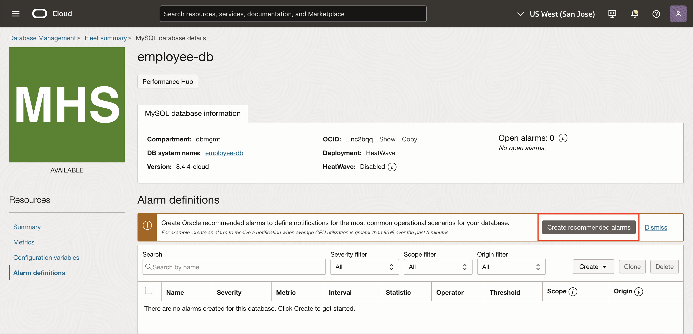

     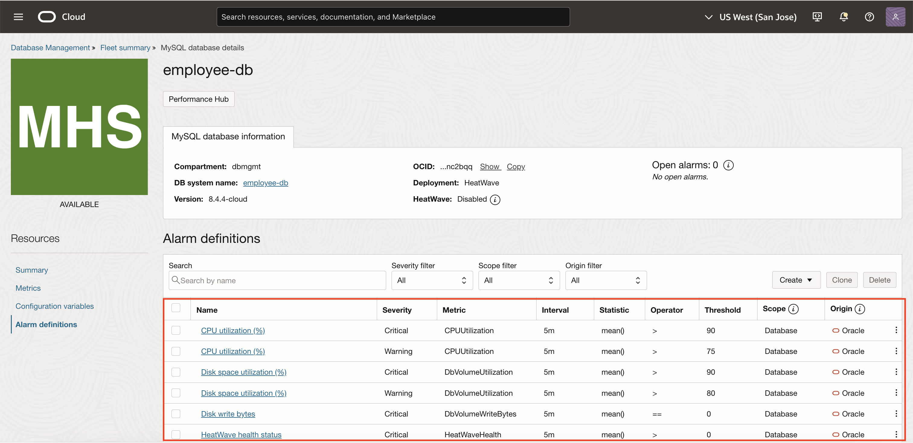

- Click the alarm to view the alarm details on the Alarm Definitions page in the Monitoring service. ?check (For Oracle-recommended alarms, the provider: DBM free-form tag is added by default during the creation process and is displayed in the Tags section.)

     

     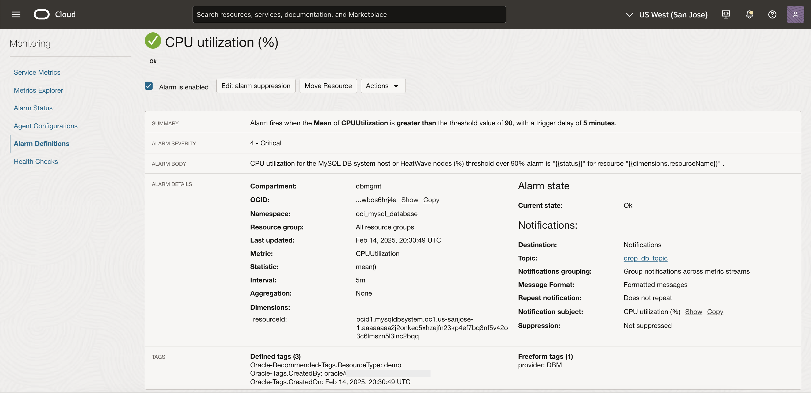

- Use the **Search** field and the filter drop-down lists above the list of alarms to filter the alarms:
     - Severity filter: View the alarms of a particular severity type (Critical, Error, Warning, Information).
     - Scope filter: View the alarms specified for all the DB systems in a compartment or the alarms specified for the DB system. By default, all the alarms are displayed.
     - Origin filter: View the Oracle-recommended alarms or the custom alarms created in the Monitoring service, for the DB system. By default, all the alarms are displayed.

     

- Optionally, you can click the Actions icon (Actions) available for each recommended alarm and click **Edit threshold** to edit the basic alarm values in Database Management or click **Edit alarm** to view and edit the complete set of values specified for the alarm in the Monitoring service. For information on the fields displayed in the Edit alarm panel, see [Edit Alarms](https://docs.oracle.com/en-us/iaas/database-management/doc/set-alarm-definitions_mysql.html#GUID-E8FF0501-4B5C-4508-A9D2-17692591B4B2).

     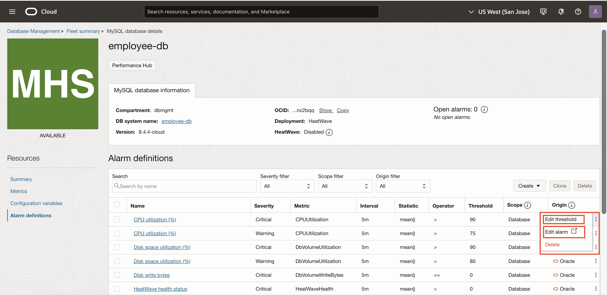

     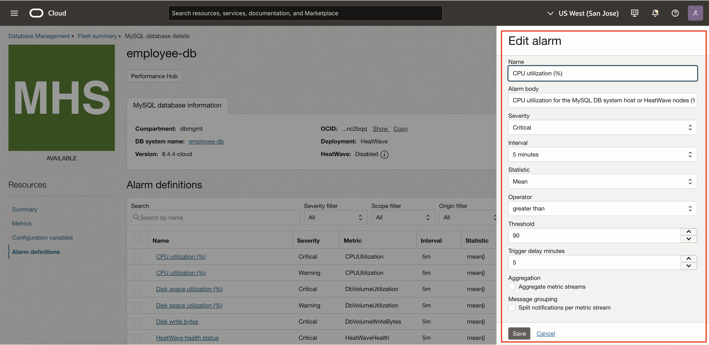

- Select alarms and click **Clone** to clone the alarms. You can clone existing Oracle-recommended or custom alarms and apply them to specific DB systems or all the DB systems in a compartment. The cloning capability reduces the effort required to create multiple alarms, and allows you to standardize alarm settings across multiple DB systems. For information, see [Clone Alarms](https://docs.oracle.com/en-us/iaas/database-management/doc/set-alarm-definitions_mysql.html#GUID-682C254A-EB5F-424B-B713-7D90737F9DDA).

     

- Select alarms and click Delete to delete the alarms.

     

## Task 7: Performance Hub

1. Click on **Performance Hub** tab on the top of the page under DB system name.

     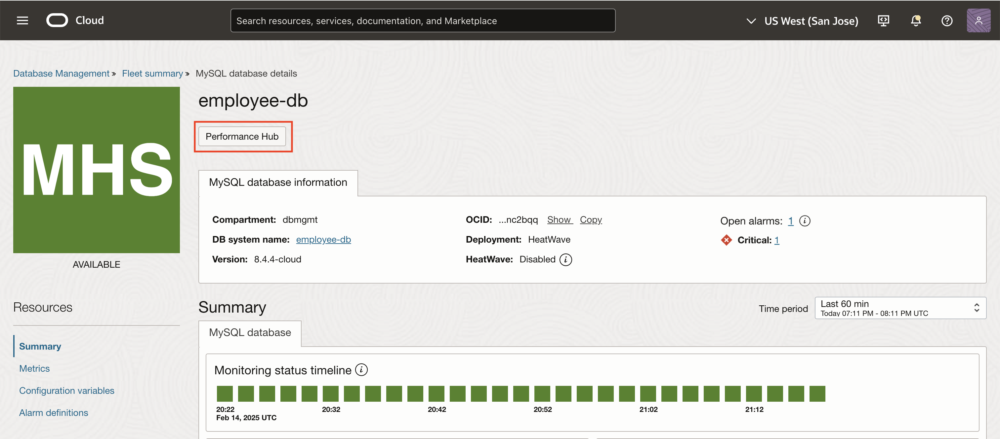

2. Using Performance Hub, you can improve the performance of your database applications by monitoring query performance. It enables you to accurately pinpoint SQL code that is the root cause of a slow down; and improve SQL code during active development as well as continuously monitor and tune queries running on production systems.

     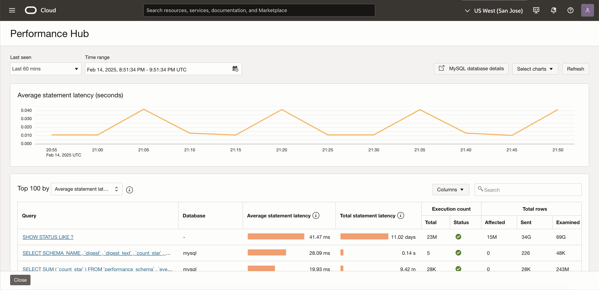

3. In Performance Hub, select an option in the **Last seen** drop-down list to specify the duration for which you want to monitor SQL activity and view the last seen SQL statements. If you select the Custom option in the Last seen drop-down list, you can specify a custom duration within the last seven-day period. The Time range field displays the time period depending on the selected Last seen option. You can also click the Time range field to specify a custom duration within the last seven-day period. To refresh the data in Performance Hub, click **Refresh** in the upper-right corner.

     

4. Based on the selected time period, relevant information is displayed in the following charts and section:

     - **Average statement latency (seconds)**: Displays the average latency (in seconds) for the SQL statements executed against the DB system.

     - Click **Select charts** in the upper-right corner and select Statement count to view the Statement count chart. This chart displays the total number of SQL statements executed against the DB system, during the selected time period. For a HeatWave DB system, the Statement count chart also displays the number of SQL statements offloaded to HeatWave for execution.

     

5. Top 100 by **indicator** section displays the aggregated summary information for the top SQL statements based on a selected indicator such as **average statement latency, total execution count, or execution status**. You can filter and monitor SQL statements to quickly identify expensive statements, customize the displayed information using the **Columns** dropdown.

     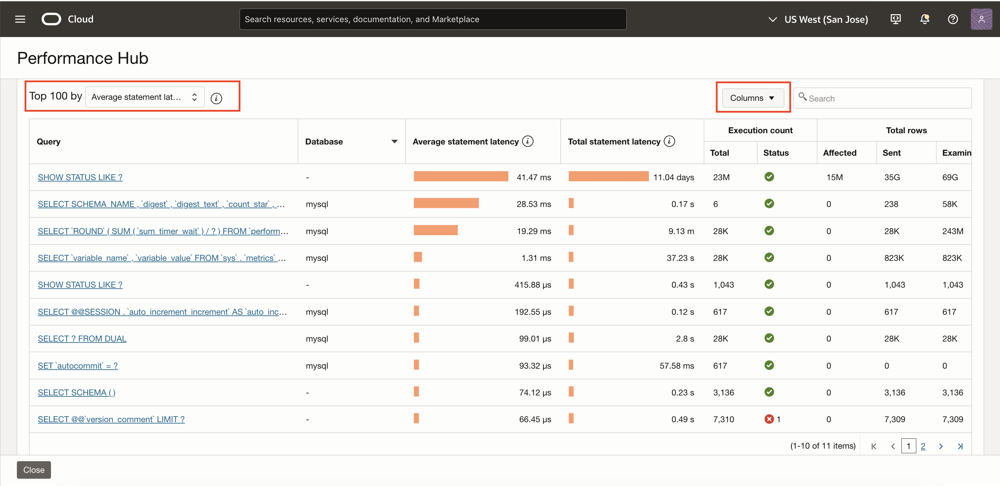

6. The listed SQL statements in the Top 100 by **indicator** section are normalized statement digests with aggregated data from the time each statement was first seen, helping you pinpoint performance issues and click the link in the Query column to examine the SQL statement in the SQL details panel. In the SQL details panel, you can:

     - Use the statement digest ID to write a query and obtain additional information from the DB system.
     - View the normalized SQL.
     - Monitor detailed information about the execution time, number of rows, and temporary tables. For example, you can monitor the number of rows that were examined or returned and the number of temporary tables that were created.
     - For information on statement digests, see [Performance Schema Statement Digests and Sampling](https://dev.mysql.com/doc/refman/8.0/en/performance-schema-statement-digests.html#statement-digests-general).

     

## Acknowledgements

- **Author** - Sindhuja Banka, HeatWave MySQL Product Manager
- **Contributors** - Sindhuja Banka, Anand Prabhu, Sriram Vrinda, Ryan Lemos
- **Last Updated By/Date** - Sindhuja Banka, March 2025
